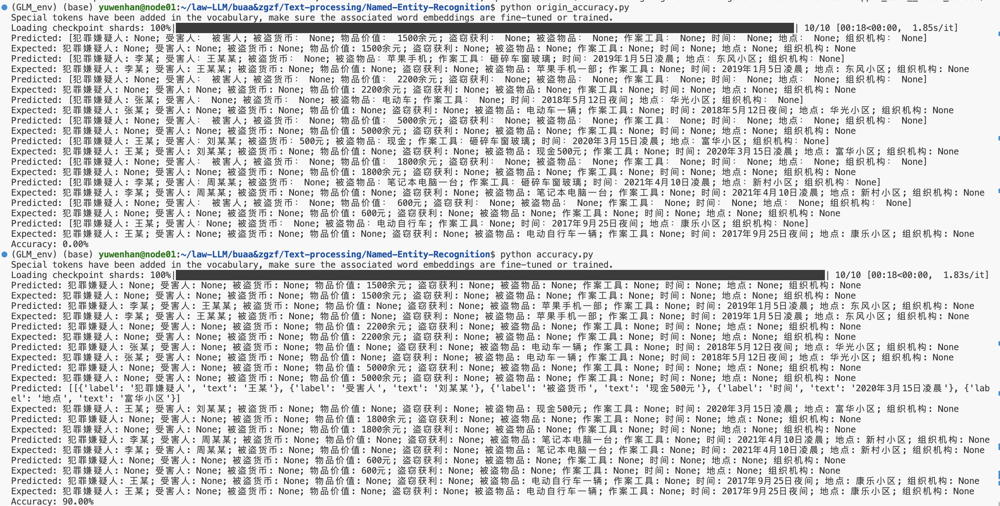

# 法律命名实体识别

## 目标
本项目的目标是利用预训练的语言模型和微调后的Lora模型进行法律命名实体识别（NER）。具体任务是从给定的法律文本中提取特定类型的实体，并按照特定的格式返回结果。

## 项目结构

- `NER.py`：主要的脚本文件，包含模型加载、文本预处理、预测以及输出处理等功能。


## 环境依赖
- `torch`
- `transformers`
- `peft`
- `pandas`

可以使用以下命令安装所需的Python库：
```bash
pip install torch transformers peft pandas
```

## 使用方法

### 1. 环境设置
确保CUDA设备已设置(可以根据需要自行修改)：
```bash
os.environ["CUDA_VISIBLE_DEVICES"] = "8"
```

### 2. 加载模型和分词器

```python
from transformers import AutoModelForCausalLM, AutoTokenizer
from peft import PeftModel

# Load tokenizer and base model
tokenizer = AutoTokenizer.from_pretrained("../../GLM-4-9B-Chat", use_fast=False, trust_remote_code=True)
model = AutoModelForCausalLM.from_pretrained("../../GLM-4-9B-Chat", device_map="auto", torch_dtype=torch.bfloat16, trust_remote_code=True)

# Load the fine-tuned Lora model
model = PeftModel.from_pretrained(model, model_id="../../finetune/output/GLM4-NER-2/checkpoint-200")

# 确定使用的设备
device = torch.device('cuda' if torch.cuda.is_available() else 'cpu')
model = model.to(device)
```

### 3. 定义指令和输入文本
```python
instruction = ("你是一个法律命名实体识别的专家。请根据给定文本，从以下十个方面（犯罪嫌疑人、受害人、被盗货币、物品价值、"
               "盗窃获利、被盗物品、作案工具、时间、地点、组织机构）提取文中的实体，没有用None表示，并按照以下格式返回结果："
               "[犯罪嫌疑人: xxx; 受害人： xxx; 被盗货币： None; ……]")

input_value = input("请输入文本内容: ")
messages = [
    {"role": "system", "content": instruction},
    {"role": "user", "content": f"{input_value}"}
]
```

### 4. 生成预测结果
```python
def predict(messages, model, tokenizer, device):
    text = tokenizer.apply_chat_template(messages, tokenize=False, add_generation_prompt=True)
    model_inputs = tokenizer([text], return_tensors="pt").to(device)

    generated_ids = model.generate(model_inputs.input_ids, max_new_tokens=512)
    generated_ids = [output_ids[len(input_ids):] for input_ids, output_ids in zip(model_inputs.input_ids, generated_ids)]
    response = tokenizer.batch_decode(generated_ids, skip_special_tokens=True)[0]

    return response

response = predict(messages, model, tokenizer, device)
```

### 5. 去重处理和输出结果
```python
import ast

# 输出去重函数
def remove_duplicates(data):
    seen = set()
    unique_data = []
    for item in data:
        item_tuple = (item['label'], item['text'])
        if item_tuple not in seen:
            seen.add(item_tuple)
            unique_data.append(item)
    return unique_data

# 使用 ast.literal_eval 将字符串转换为列表
data_list = ast.literal_eval(response)
unique_data = remove_duplicates(data_list)
print(unique_data)

import pandas as pd

# Convert the output to a table
def convert_to_table(response):
    df = pd.DataFrame([response])
    return df

# Use the function to convert response to table
df = convert_to_table(unique_data)
if df is not None:
    print(df)
```

### 6. 运行脚本
将上述代码保存为`NER.py`，运行脚本：
```bash
python NER.py
```

根据提示输入文本内容，即可获得命名实体识别结果，并将结果去重和转换为表格格式进行展示。

## 注意事项
- 确保模型和数据路径正确。
- 输入的文本应尽量符合指令中提到的法律文本特征，以提高识别准确性。
- 处理后的数据文件中只保留符合特定标准的文书内容，可能会导致原始数据量的减少。


## 运行结果

使用GPT4生成测试数据集，保证测试数据与训练数据不同
分别测试原始模型与lora微调后的模型，得到结果