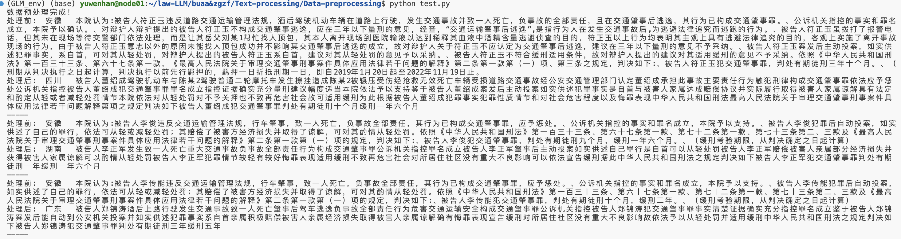
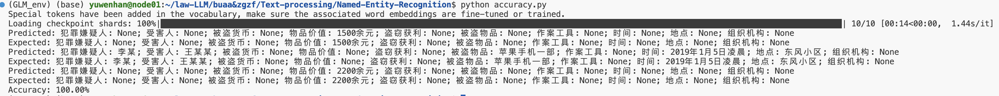
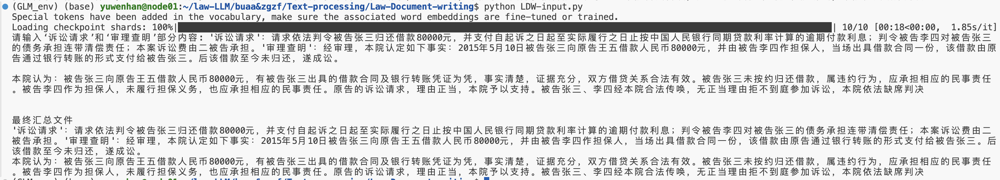
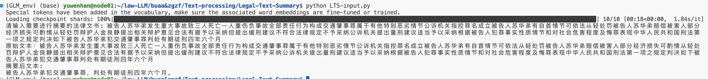
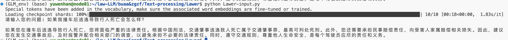
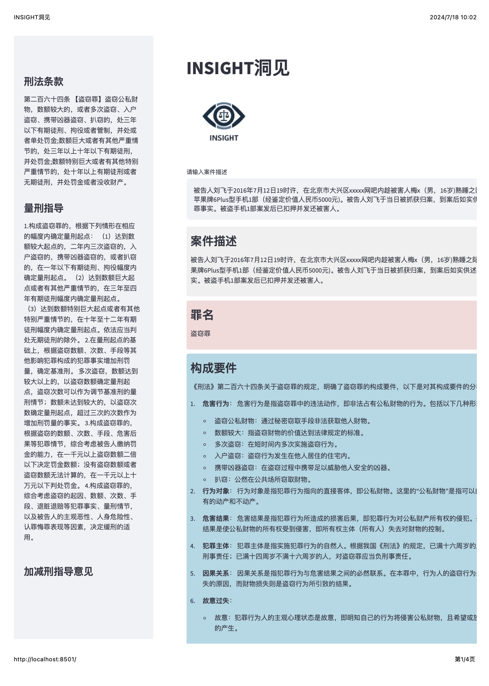

# 基于GLM4的法律文书处理和智能司法决策
## 法律文书处理
在`Text-processing`文件夹下，有不同的法律文书处理相关程序，具体使用方式见`Text-processing`中的使用方法，包含**数据预处理**、**命名实体识别**、**法律文本摘要生成**，**特定法律文书撰写**等
### 数据预处理

### 命名实体识别

### 法律文本撰写

### 法律文本摘要

### 律师法律咨询

## 智能司法决策框架
通过RAG和COT技术，实现对一个刑事案件的智能司法判决。
### insight web demo

## 基于RAG的法律问答

## 注
本项目仍在开发阶段，github作为一个云端存储容器，之后的开发会不断改进～