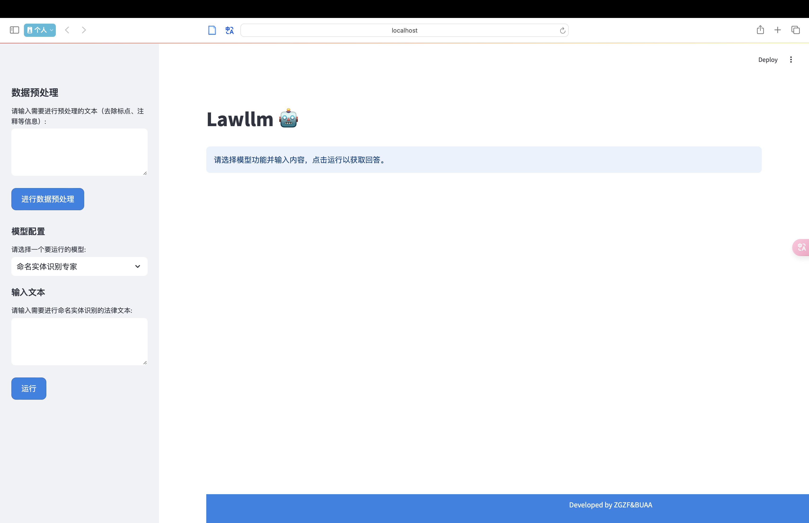
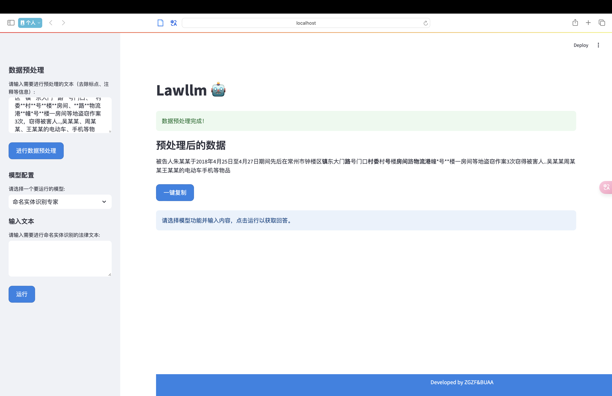
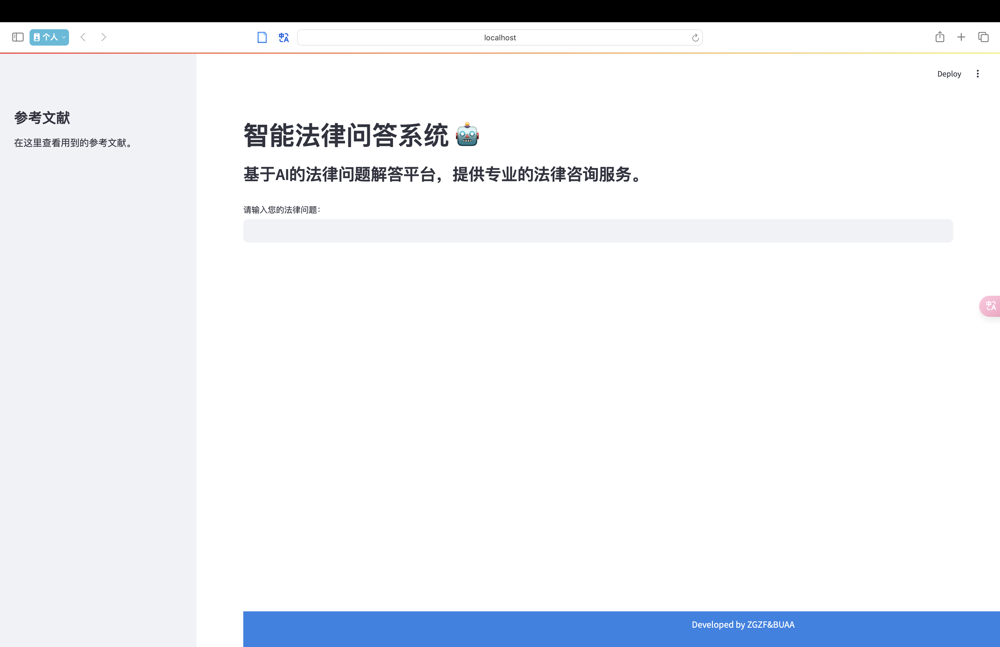
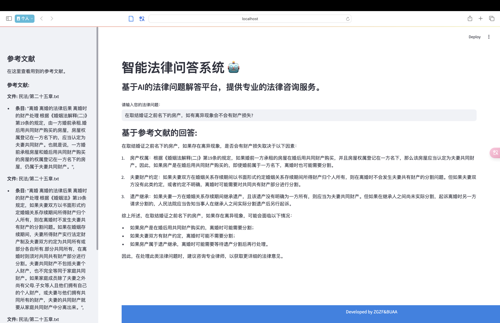
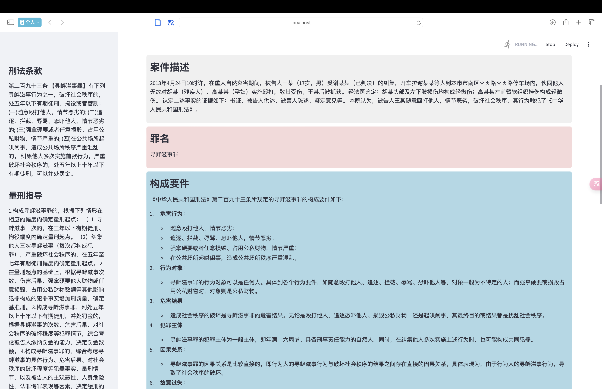
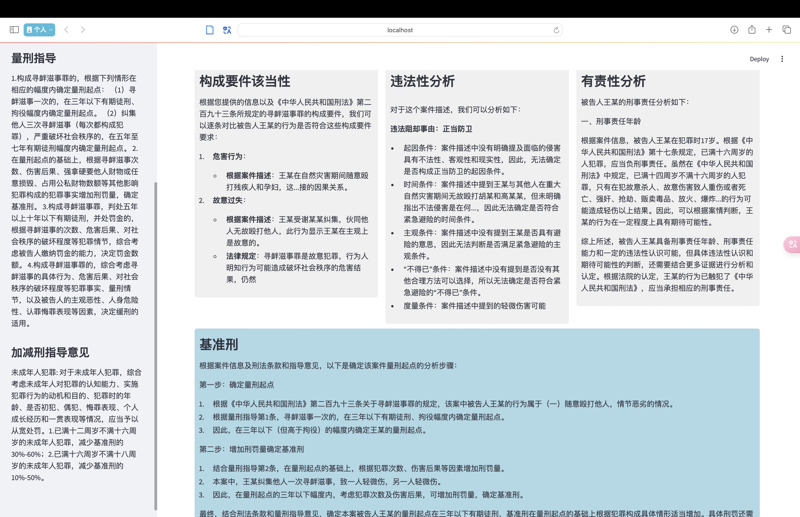
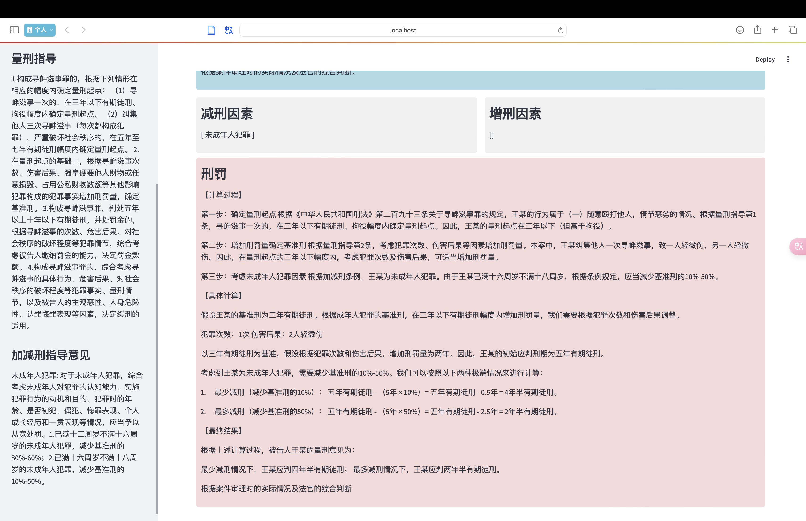

## Law-LLM 系统使用手册

### 系统概述

Law-LLM 项目结合了法律知识与人工智能技术，基于 GLM-4-Chat 模型，并通过 **Lora 微调**、**RAG（检索增强生成）** 和 **思维链（COT）** 技术进行增强，旨在提供符合法律领域需求的智能化应用。

### 环境配置

为确保项目顺利运行，推荐以下硬件和软件配置：

#### 1. 系统要求

- **硬件**：
  - **GPU**：至少需要一块 NVIDIA A100-PCIE-40GB GPU 用于模型训练和运行。对于 RAG 的网页推理，需要至少两块 NVIDIA A100-PCIE-40GB GPU。

- **软件**：
  - **操作系统**：推荐使用 Linux 发行版（如 Ubuntu）或 Windows，以支持必要的 GPU 驱动和依赖库。
  - **Python**：需要 Python 版本 3.10 以上。可以通过以下命令检查当前版本：
    ```bash
    python --version
    ```
    或
    ```bash
    python3 --version
    ```
  - **依赖管理**：建议使用 `pip` 管理 Python 包依赖，并在虚拟环境中安装所有依赖项。

#### 2. 虚拟环境配置

建议使用虚拟环境来管理和隔离项目的依赖项。以下是配置和使用虚拟环境的步骤：

1. **创建虚拟环境**：
   ```bash
   python -m venv venv
   ```

2. **激活虚拟环境**：
   - **Windows**:
     ```bash
     .\venv\Scripts\activate
     ```
   - **macOS/Linux**:
     ```bash
     source venv/bin/activate
     ```

3. **安装项目依赖**：
   ```bash
   pip install -r requirements.txt
   ```

4. **确认依赖项安装**：
   ```bash
   pip list
   ```

### 运行系统

在开始使用前，需要下载必要的模型权重和其他资源。

#### 1. 下载 GLM-4-9B-Chat 模型权重

```bash
bash download.sh
```

#### 2. 基于 Lora 微调的法律文本处理

进入 `web-final` 文件夹，运行以下命令：

- **本地运行**：
  ```bash
  streamlit run text-processing.py
  ```

- **服务器部署**：
  ```bash
  streamlit run text-processing.py --server.address 0.0.0.0
  ```

#### 3. 基于 RAG 的法律问题智能回复

依次执行以下步骤：

1. **下载 tokenizer**：
   ```bash
   python download_tokenizer.py
   ```

2. **生成 FAISS 索引**：

   进入 `RAG/code` 文件夹，运行：
   ```bash
   python ff.py
   ```

3. **启动网页界面**：

   进入 `web-final` 文件夹，运行：
   - **本地运行**：
     ```bash
     streamlit run answer-with-rag.py
     ```

   - **服务器部署**：
     ```bash
     streamlit run answer-with-rag.py --server.address 0.0.0.0
     ```

#### 4. 基于 COT 可解释性增强的智能司法决策框架

进入 `web-final` 文件夹，运行以下命令：

- **本地运行**：
  ```bash
  streamlit run insight.py
  ```

- **服务器部署**：
  ```bash
  streamlit run insight.py --server.address 0.0.0.0
  ```

### 运行结果
#### 基于lora微调的法律文本处理web-demo与运行结果

  

#### 基于RAG的法律问题智能回复

 

#### 基于 COT 可解释性增强的智能司法决策框架
 
  
 
 